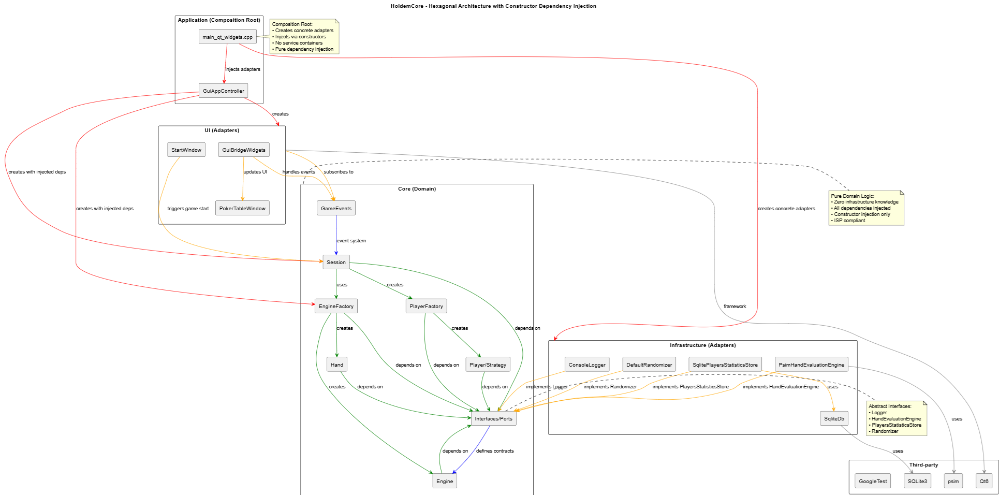

# HoldemCore

**🌐 Language / Langue:** [English](README.md) | [Français](README_fr.md)

**Portfolio Project: Modern C++ Architecture**

HoldemCore is a **Texas Hold'em simulation engine** built in **modern C++20**, demonstrating a showcase of
Ports & Adapters (aka hexagonal) architecture and SOLID principles application.

The original project (2011) has been **fully modernized in 2025** to showcase professional software craftsmanship.

> **Portfolio Notice:**  
> This repository is maintained as a demonstration of C++ architecture and engineering quality.  
> Issues and PRs are welcome, but the roadmap follows the author's priorities.

---

## 🎯 Project Highlights

- **Ports & Adapters Architecture** ensuring maximal testability, flexibility, clean separation between domain, infrastructure, and UI
- **Comprehensive test suite** with full unit and end-to-end coverage
- **Cross-platform design** using CMake and modern C++
- **Multiple UIs:** Qt Widgets and Qt Quick (QML), easily extensible to other UI frameworks
- **Implement easily new bots strategies**, via simple abstract interfaces
- **Event-driven engine** with clear state machine implementation

---

## 🚀 Quick Start

### Prerequisites
- CMake ≥ 3.20
- C++20-compatible compiler
- Qt 6.x (only for optional GUI components)

### Build & Test the engine core
```bash
git clone https://github.com/Marcennaji/HoldemCore.git
cd HoldemCore
cmake --preset debug-widgets
cmake --build build/debug-widgets
.\build\debug-widgets\tests\unit_tests.exe
.\build\debug-widgets\tests\e2e_tests.exe
```

---

## 🏗️ Architecture Overview

Detailed explanation and diagrams:  
👉 [ARCHITECTURE.md](doc/ARCHITECTURE.md)

**Architecture Quality:**  
📋 [Independent SOLID & Hexagonal Architecture Review](doc/ARCHITECTURE_REVIEW.md) — Systematic analysis confirming zero significant architectural issues.

<p align="center">
  
</p>

---

## 🧰 Technical Stack

**Languages & Frameworks**
- Modern **C++20**
- **CMake** build system
- **Qt 6** Widgets and QML, if you wish to use the provided (and optional) UIs
- **GoogleTest** for testing
- **SQLite3** for persistence

**Third-Party Components**
- [psim](https://github.com/christophschmalhofer/poker/tree/master/XPokerEval/XPokerEval.PokerSim)
- [SQLite3](https://www.sqlite.org/)
- [GoogleTest](https://github.com/google/googletest)

**License:** MIT — free for commercial and personal use.

---

## 📈 Next steps

- 🧠 Add QML front-end (mobile)

---

## 👨‍💻 Author

**Marc Ennaji** — Senior Software Engineer  
[LinkedIn](https://www.linkedin.com/in/marcennaji/)

### Expertise
- Modern C++
- Software Architecture & Design
- Legacy System Modernization


